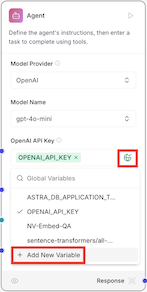
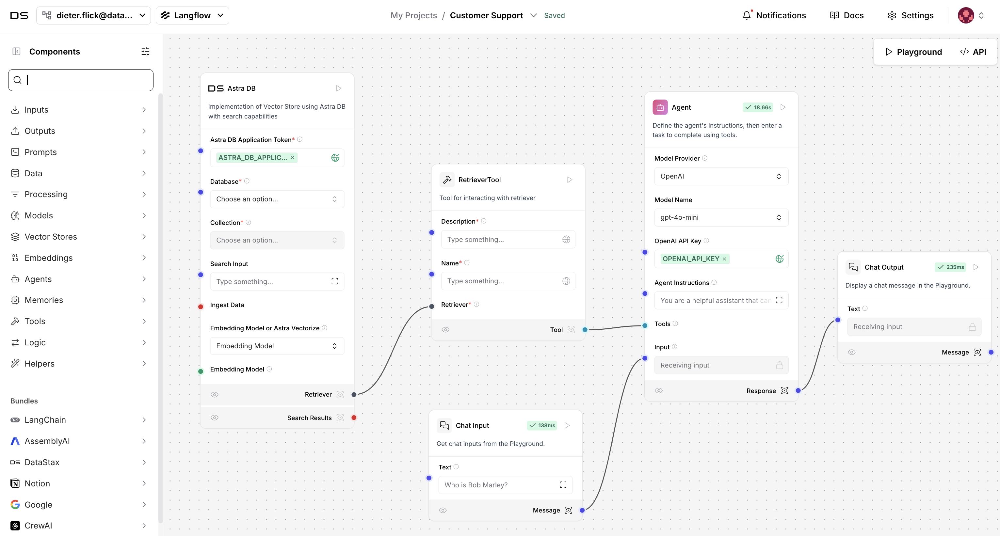
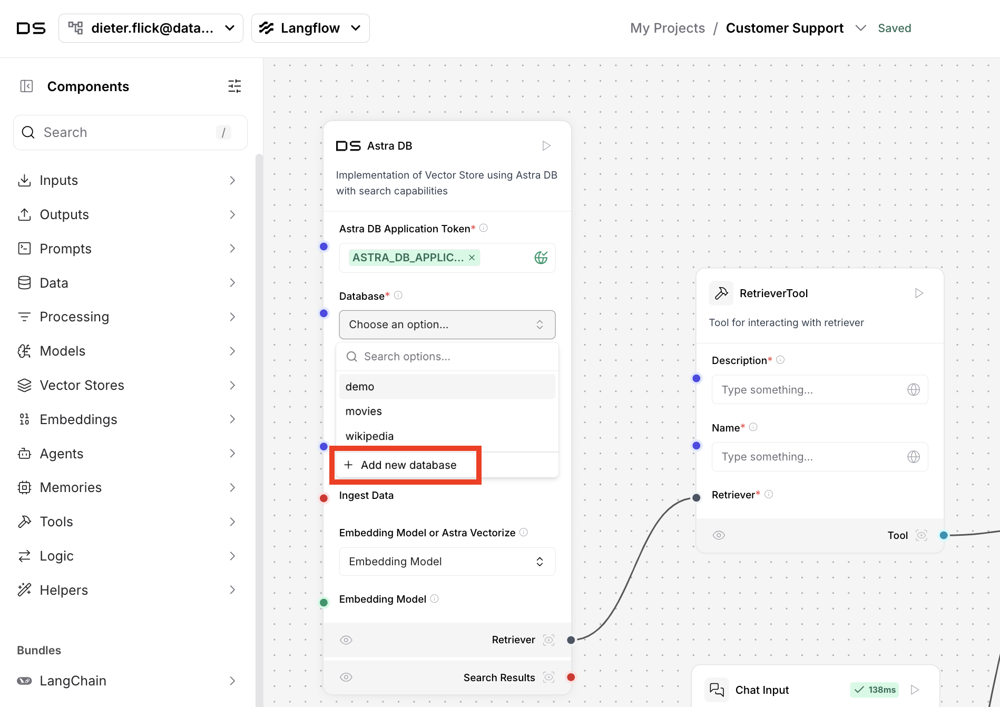
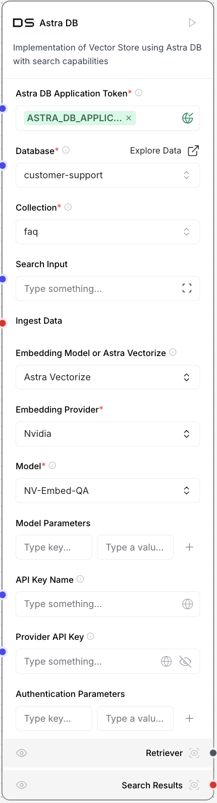
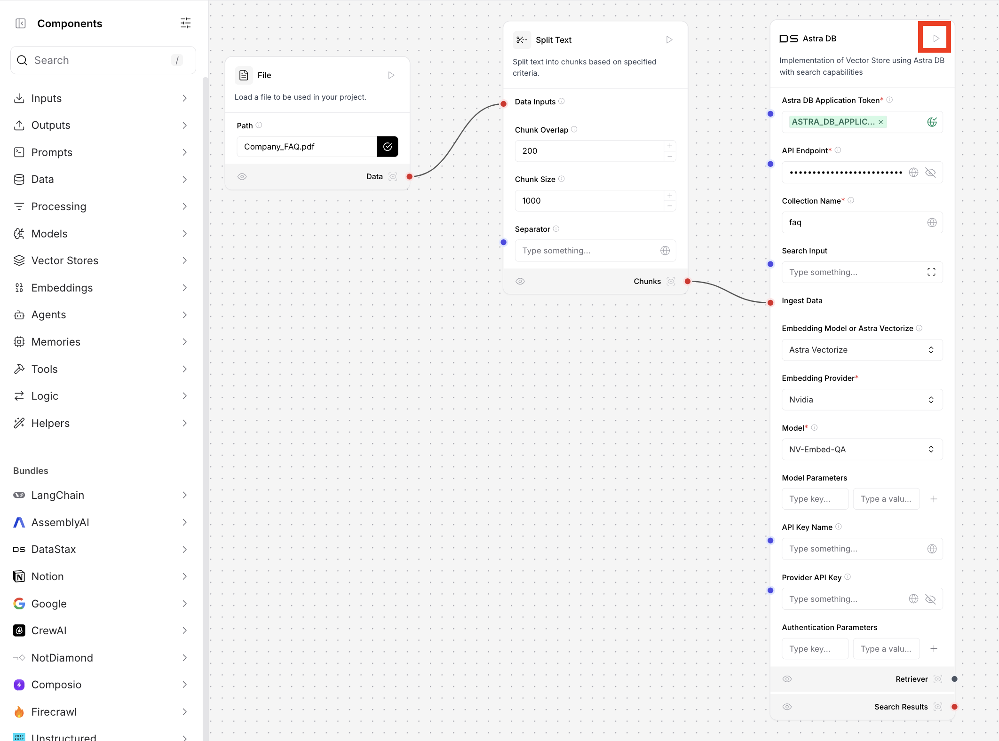
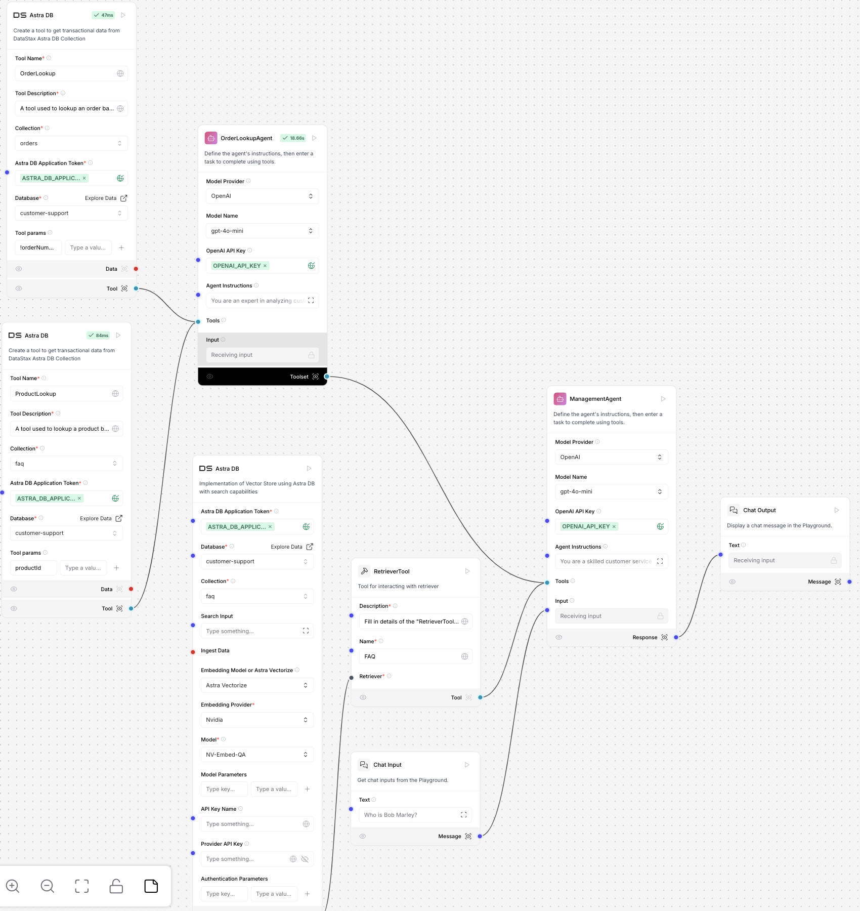
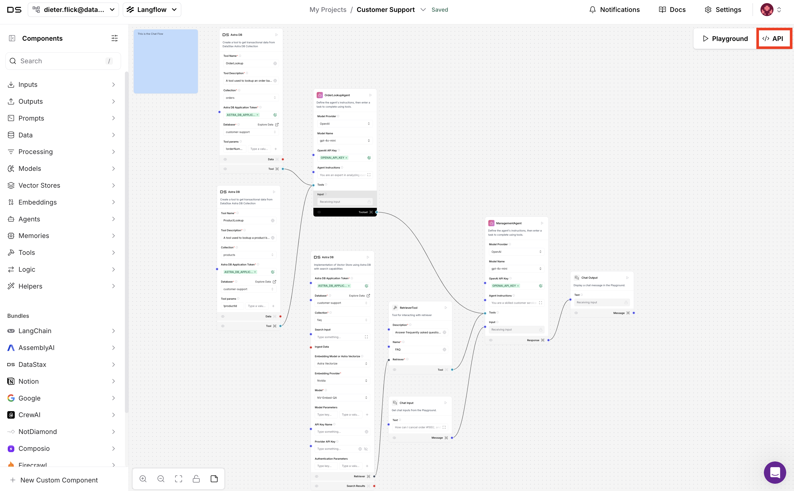

# Mastering Agentic AI with Langflow and Astra DB 🚀


---

## Workshop Overview 🛠️✨

Welcome to this transformative workshop! Today, we’ll explore how to build an **Agentic AI Application** using **Langflow** and **Astra DB**. By the end of this workshop, you’ll have created a powerful customer support system capable of:

- **Handling FAQs** with contextual accuracy.
- **Processing customer orders** effortlessly.
- **Retrieving real-time product details** through seamless integrations.

### Key Technologies

- **[Langflow](https://www.langflow.org/)**: A low-code platform enabling drag-and-drop simplicity for AI workflows.
- **[Astra DB](https://www.datastax.com/products/datastax-astra)**: A vector-enabled database designed for real-time semantic search and advanced querying.

### What You’ll Learn:

- How to implement **retrieval-augmented generation (RAG)** for precise FAQ handling.
- Building **multi-agent systems** to tackle complex queries.
- Deploying an **AI-powered customer support agent** with a Streamlit front end.

Get ready to build scalable, real-world AI applications that make a difference.


---

## Use Case: Empowering Customer Support with AI 🤝💡

### Why This Use Case Matters

E-commerce businesses face constant customer inquiries about:
- Shipping times
- Order statuses
- Product details

**Challenges**:
- Manual responses are time-consuming and prone to errors.
- Scaling support teams to meet demand is costly.

**Solution**:
An AI-driven customer support system can:
- **Efficiently answer FAQs** using retrieval-augmented generation.
- **Access real-time order and product data** from a centralized database.
- **Scale effortlessly** to handle high query volumes with minimal intervention.

---

## Workshop Goal 🎯

By the end of this workshop, you’ll build a system capable of:
1. **Answering FAQs** with RAG.
2. **Querying Orders** using Astra DB.
3. **Collaborating Agents** to address multi-faceted queries.

Let’s dive in!


---

## Prerequisites ✅

This workshop assumes you have access to:
1. A **[GitHub account](https://github.com)**.
2. A paid **OpenAI account**. *(We will provide API keys if needed.)*

Additionally, create free accounts for:
- **Streamlit**: Follow the [quickstart guide](https://docs.streamlit.io/streamlit-community-cloud/get-started/quickstart).
- **Langflow**: [Sign up here](https://astra.datastax.com/signup?type=langflow).

---

## Let’s Make Magic Happen! 🦄✨

We’ll begin by implementing a multi-agent-based flow for our frontend application. This flow will be the backbone for delivering accurate and dynamic responses to customer inquiries.

### Step 1: **Set Up Our Flow** 🛠️🌟

Let’s start by setting up a new flow in Langflow. This serves as the foundation for our project.

1. **Create a New Flow:** ➕  
   - Open [Langflow](https://astra.datastax.com/langflow) and click the **New Flow** button on the dashboard.  
   - This will open the flow creation interface.  

   

2. **Choose a Blank Flow Template:** 📄  
   - Select the **Blank Flow** option from the available templates.  
   - Langflow offers a variety of templates for different AI workflows, which is continuously expanding.

   

3. **Name Your Flow:** ✏️  
   - Click **Flow Settings** to configure these details.

     

   - Provide a meaningful name for your flow that reflects its purpose.  
   - Define the API endpoint to make the flow accessible via external HTTP calls.  

   

> **🎉 Success!** Your flow is now set up and ready for development. Next, we’ll create a simple echo flow to see how components interact.  

--- 

### Step 2: **Create a Simple Echo Flow** 🔁💬

To understand the basics of Langflow, let’s create a simple flow where the input is echoed back to the user. This will help us get familiar with the interface and how components interact.

1. **Add Components:** 🧩  
   - Drag `Chat Input` and `Chat Output` components from the left-hand panel onto the canvas.  
   - These components represent the user input and the system response, respectively.

2. **Connect the Components:** 🔗  
   - Link the `Chat Input` component to the `Chat Output` component.  
   - This creates a direct flow where user input is sent directly to the output.

   

3. **Test in the Playground:** 🎮  
   - Click the **Playground** button to test the flow.  
   - In the Playground, type:  
     ```
     hello
     ```  
   - Observe how the input is echoed back in the output.

   

> **🎉 Success!** You’ve created your first flow in Langflow. This simple echo flow demonstrates how components can interact. Next, let’s extend this flow by introducing an agent to handle more complex tasks.

---

### Step 3: **Extend the Flow with an Agent** 🤖💡

To enable more advanced capabilities, we will extend the flow by integrating an agent. This agent will serve as the brain behind our application, processing inputs and interacting with tools.

1. **Remove Existing Connections:** ✂️  
   - Disconnect the `Chat Input` and `Chat Output` components.

2. **Add an Agent Component:** 🧩  
   - Drag and drop the `Agent` component onto the canvas.  

3. **Connect the Components:** 🔗  
   - Link the `Chat Input` component to the `Agent` component.  
   - Connect the `Agent` component to the `Chat Output` component.  

   

4. **Configure API Credentials:** 🔑  
   - The agent supports various LLM providers. For this workshop, we use OpenAI, which requires an API key.  
   - Click the icon in the **OpenAI API Key** field of the agent.  
   - Add a new variable of type **Credential**, name it `OPENAI_API_KEY`, and select the variable.  

   

5. **Set Agent Instructions:** 📜  
   - Instructions provide the agent with guidance on what tasks to perform and how to interact with tools.  
   - Click the icon in the **Agent Instructions** field to view the default instruction:  
     ```
     You are a helpful assistant that can use tools to answer questions and perform tasks.
     ```  
   - For now, we will leave this default instruction unchanged.

6. **Test the Flow in the Playground:** 🎮  
   - Open the **Playground**, enter a query like:  
     ```
     Who is Bob Marley?
     ```  
   - Observe the agent's response and verify that it processes the input correctly.  

   


> **🎉 Success!** You’ve successfully integrated an agent into your flow. This marks a significant step toward creating a smart and interactive application. Next, let’s tailor the agent for our specific use case: the "Customer Support Agent."  

---

### Step 4: **Implement the RAG Flow** 🔍📚

The agent we developed so far cannot answer questions specific to our context and may hallucinate, producing irrelevant or incorrect responses. To address this, we’ll implement a Retrieval-Augmented Generation (RAG) flow. This approach allows the agent to retrieve relevant data from the company’s FAQ database for accurate responses.

1. **Add an Astra DB Component:** 🗄️  
   - Drag an `Astra DB` component onto the canvas from the **Vector Stores** section.  
   - This component will store and retrieve vectorized FAQ data.

2. **Add a Retriever Tool:** 🛠️  
   - Drag a `RetrieverTool` component onto the canvas from the **Tools** section.  
   - This tool will enable the agent to search the FAQ database for relevant information.

3. **Connect the Components:** 🔗  
   - Link the `Retriever` output of the `Astra DB` component to the `Retriever` input of the `RetrieverTool` component.  
   - Connect the `Tools` output of the `RetrieverTool` component to the `Agent` component.

   

4. **Create a New Database in Astra DB:** 📋  
   - In the `Astra DB` component, click **Add New Database** to create a new database.  
 
     
   
   - Fill in the required details and click **Create Database**.

   

   > **Note:** Database creation may take a few minutes.

5. **Switch to Astra DB:** 🔄  
   - Open Astra DB and navigate to your newly created database.  

   

6. **Create an FAQ Collection:** 🗂️  
   - In Astra DB, go to **Data Explorer** and click **Create Collection**.  

     

   - Name the collection `faq`, enable the **Vector-Enabled Collection** option, and click **Create Collection**.  

   

7. **Switch Back to Langflow:** ↩️  
   - Return to Langflow to continue configuring the RAG flow.  

   

8. **Configure the Astra DB Component:** ⚙️  
   - Fill in the following details in the `Astra DB` component:
     - **Collection Name:** `faq`
     - **Embedding Model or Astra Vectorize:** `Astra Vectorize`
     - **Embedding Provider:** `Nvidia`
     - **Model:** `NV-Embed-QA`

   

9. **Configure the RetrieverTool Component:** 🛠️  
   - Provide the `RetrieverTool` with:
     - **Name:** `FAQ`
     - **Description:**  
       ```text
       Answer frequently asked questions (FAQs) about shipping, returns, placing orders, and more.
       ```

10. **Define Agent Instructions:** ✍️  
    - Add the following instructions to the **Agent Instructions** field:
      ```text
      Your primary responsibility is to use the available tools to accurately address user inquiries and provide detailed, helpful responses. You can:

      - Answer frequently asked questions (FAQs) about shipping, returns, placing orders, and more.

      Example: If the ask is about delivery times, check the FAQ.
      Always aim to deliver clear, concise, and user-focused solutions to ensure the best possible experience.
      ```

11. **Test the RAG Flow:** 🎮  
    - Open the **Playground** and test the flow with a query like:
      ```
      What are the shipping times?
      ```
    - Observe the response and confirm the agent uses the `RetrieverTool` effectively.

    

12. **Verify the Flow:** ✅  
    - **Test Point 1:** Observe that the agent is unable to respond meaningfully without context.

> **🎉 Success!** Your agent now includes a RAG flow to answer context-specific queries accurately. The foundation is laid—next, we’ll enrich the agent with the required FAQ data. Say goodbye to hallucinations and hello to reliable responses!  

---

### Step 5: **Vectorize the FAQ** 📚✨

The agent cannot yet provide proper answers because it lacks the necessary information from the FAQ. Although we have an FAQ collection in the database, it is currently empty. Let’s populate it using a vectorization flow in Langflow.

---

1. **Add a File Component:** 📂
   - Drag a `File` component onto the canvas from the **Data** section.
   - This will allow you to upload the `Company_FAQ.pdf`.

2. **Add a Split Text Component:** ✂️
   - Drag a `Split Text` component onto the canvas from the **Processing** section.
   - This will break the FAQ document into manageable chunks for vectorization.

3. **Add an Astra DB Component:** 🗄️
   - Drag an "Astra DB" component onto the canvas from the **Vector Stores** section.
   - This will serve as the storage for the vectorized data.

4. **Connect the Components:** 🔗
   - Link the `Data` endpoint of the `File` component to the `Data Inputs` endpoint of the `Split Text` component.
   - Link the `Chunks` endpoint of the `Split Text` component to the `Ingest Data` endpoint of the `Astra DB` component.

5. **Upload the FAQ Document:** 📥
   - Upload the `Company_FAQ.pdf` file via the `File` component.

6. **Configure the Astra DB Component:** 🛠️
   - Fill in the details of the `Astra DB` component:
     1. **Collection Name:** `faq`
     2. **Embedding Model or Astra Vectorize:** `Astra Vectorize`
     3. **Embedding Provider:** `Nvidia`
     4. **Model:** `NV-Embed-QA`

   

7. **Execute the Flow:** ▶️
   - Click the play button on the `Astra DB` component to run the flow.
   - The PDF will be split into chunks, which will then flow into the `Astra DB` component for vectorization and storage alongside their corresponding vectors.

   

8. **Test the RAG Flow in the Playground:** 🎮
   - Open the **Playground** and query the system with:
     ```
     What are the shipping times?
     ```
   - Confirm that the system retrieves accurate responses based on the newly vectorized FAQ data.

   

9. **Verify Vectorization:** ✅
- **Test Point 1:** Ensure that the `faq` collection in Astra DB contains the vectorized data by querying it directly in Astra DB.
- **Test Point 2:** Use queries like "What are the shipping times?" in the Langflow Playground to validate that the agent can now provide accurate responses based on the FAQ.

> **🎉 Success!** The FAQ has been successfully vectorized and integrated into the system. Your agent is now equipped to handle context-specific queries with precision!

---

### Step 6: **Upload Sample Data** 📦💾

To create a comprehensive customer support system, the agent must retrieve order details from the database. Let’s upload some sample data into Astra DB to enable this functionality.

---

1. **Switch to Astra DB:** 🔄
   - From Langflow, navigate to Astra DB by clicking on the appropriate link or switching tabs.
   
   

2. **Create the `Orders` Collection:** 📝
   - In Astra DB, click on your `customer-support` database and then open the **Data Explorer**.
   - Click on **Create Collection** to start setting up a new collection.
     - Collection Name: `orders`
     - Disable the **Vector-enabled collection** switch.
     - Click **Create Collection**.

   

3. **Create the `Products` Collection:** 🛒
   - Follow the same steps as above to create a second collection:
     - Collection Name: `products`
     - Disable the **Vector-enabled collection** switch.
     - Click **Create Collection**.

4. **Load Data into the `Orders` Collection:** 📥
   - Select the `orders` collection in the **Data Explorer**.
   - Click on **Load Data** to begin importing sample data.
   
   

   - Upload the file: [sample_orders.csv](./sample_orders.csv).

   

5. **Load Data into the `Products` Collection:** 📦
   - Select the `products` collection in the **Data Explorer**.
   - Click on **Load Data** and upload the file: [sample_products.csv](./sample_products.csv).

6. **Verify Data Uploads:** ✅
- **Test Point 1:** Ensure that the `orders` collection contains the expected data by querying it in Astra DB.
- **Test Point 2:** Verify that the `products` collection also reflects the uploaded sample data.
  

  > **🎉 Success!** Your sample data is now loaded into Astra DB, making it ready for integration with your `OrderLookupAgent` and other flows.
  
7. **Return to Langflow:** 🔙
   - After uploading data, switch back to Langflow to continue working on your flows.

   

---

### Step 7: **Build the Order Lookup Agent Flow** 🛠️🔍

To create a comprehensive customer support system, the agent must retrieve order details from the database. Let’s implement the **Order Lookup Agent Flow** and the tools it will use to provide this functionality.

---

1. **Add Astra DB Components:** 📦
   - Drag and drop an **Astra DB** component onto the canvas for the `orders` collection:
     - Tool Name: `OrderLookup`
     - Database Name: `customer-support`
     - Collection Name: `orders`
     - Tool Description: `A tool used to look up an order based on its ID.`
     - Tool Params: `!orderNumber`

   - Drag and drop another **Astra DB** component onto the canvas for the `products` collection:
     - Tool Name: `ProductLookup`
     - Database Name: `customer-support`
     - Collection Name: `products`
     - Tool Description: `A tool used to look up a product based on its ID.`
     - Tool Params: `!productId`

2. **Add an Agent Component:** 🤖
   - Drag and drop an **Agent** component onto the canvas to serve as the logic handler for order lookups.
   - Configure the agent with:
     - **OpenAI API Key**: Add your API key.
     - **Agent Instructions**: Provide the following instructions:
       ```text
       You are an expert in analyzing customer orders and providing detailed and accurate information. Your primary role is to utilize the provided tools to efficiently look up order numbers, retrieve relevant details about the orders, and address any questions or concerns the user may have. Always aim to deliver clear, concise, and helpful responses, ensuring the user's needs are fully met.

       Lookup order numbers and product IDs using the tools provided.

       Orders always contain an array of product IDs. Use these IDs to look up the specific products from the product lookup tool and aggregate the product information with the order to provide a clear summary of the order.

       If the order does not exist, simply tell the user to try again as the ID wasn't found.

       Only return information about orders; do not return anything else.
       ```

   - Enable **Tool Mode** and provide meaningful labels:
     - Rename the component to `OrderLookupAgent`.

   

3. **Connect Components:** 🔗
   - Connect the `Data` endpoints of both `Astra DB` components to the `Tools` endpoint of the `OrderLookupAgent`.

4. **Validate the Flow:** ✅
   - Click the **Play** button on the `OrderLookupAgent` to ensure the flow is configured correctly.

   

> **🎉 Congratulations!** You’ve successfully created an `OrderLookupAgent` that integrates seamlessly with your Astra DB collections. This agent can now retrieve and aggregate order and product data, a critical component for your customer support system!

---

### Step 8: **Combine Both Flows with a Manager** 🛠️🤖

We now have two flows: the **RAG Flow** and the **Order/Product Lookup Flow**. Let’s combine their powers by introducing a `ManagementAgent`. This agent will intelligently route user inquiries to the right flow, ensuring accurate and complete responses.

---

1. **Rename the RAG Agent:** ✏️
   - Rename the existing RAG agent to `ManagementAgent` to reflect its role as a central coordinator.

2. **Define ManagementAgent’s Role:** 📜
   - Provide the `ManagementAgent` with clear, detailed instructions to guide its interaction with the FAQ and Order Lookup tools:
     ```text
     You are a skilled customer service manager and information router. Your primary responsibility is to use the available tools to accurately address user inquiries and provide detailed, helpful responses. You can:

     - Look up order numbers to retrieve and share order details.
     - Access product information to provide relevant descriptions or specifications.
     - Answer frequently asked questions (FAQs) about shipping, returns, placing orders, and more.

     If a query requires multiple tools, combine their outputs to deliver a comprehensive response. 
     Example: For an inquiry about canceling an order, retrieve the order and product details, and also reference the FAQ for the cancellation policy.

     Always aim to deliver clear, concise, and user-focused solutions to ensure the best possible experience.
     ```

3. **Connect the Tools to ManagementAgent:** 🔗
   - Link the `OrderLookupAgent` component’s `Toolset` endpoint to the `ManagementAgent` component’s `Tools` endpoint.

     

4. **Test ManagementAgent in the Playground:** 🎮
   - Click the **Playground** button and enter the following query:
     ```
     What is the status of order #1001?
     ```
     Confirm that the response combines relevant data from the `Orders` and `Products` collections.

     

5. **Conduct Comprehensive Testing:** ✅
   - **Test Point 1:** Check that responses accurately reflect the data in the `Orders` and `Products` collections. 📋
   - **Test Point 2:** Try mixed queries (e.g., "How can I cancel order #1001?") to confirm that the `ManagementAgent` routes tasks appropriately. Mixed queries test the agent's ability to handle multiple tools and provide an aggregated response, a crucial feature of a robust AI system. 🔄

> **🎉 Congratulations!** You’ve successfully created a `ManagementAgent` that combines and coordinates the functionalities of the RAG and Order Lookup flows. Your customer support system is now equipped to handle complex and multi-faceted queries with ease.

---

### Step 9: **Integrate with a Python Front End** 🖥️🐍

In this step, we’ll create a user-friendly interface using a Streamlit-based Python application. This front end will connect to your Langflow-powered backend, allowing users to interact with your AI system effortlessly.

1. **Clone the Repository:** 📁  
   - Download the application files from GitHub:
     ```bash
     git clone https://github.com/difli/agentic-ai-workshop.git
     cd agentic-ai-workshop
     ```

2. **Set Up a Virtual Environment:** 🐍  
   - Create and activate a Python virtual environment:
     ```bash
     python3 -m venv venv
     ```
     - On Linux/Mac:
       ```bash
       source venv/bin/activate
       ```
     - On Windows:
       ```bash
       venv\Scripts\activate.bat
       ```

3. **Install Dependencies:** 📦  
   - Install the required Python packages:
     ```bash
     pip install -r ./requirements.txt
     ```

4. **Configure Secrets:** 🔑  
   - Copy the example secrets file:
     ```bash
     cp .streamlit/secrets.toml.example .streamlit/secrets.toml
     ```
   - Open `secrets.toml` and update the placeholders:
     ```plaintext
     LANGFLOW_ID = "Your_Langflow_ID"
     ENDPOINT = "Your_Langflow_Endpoint"
     APP_TOKEN = "Your_Application_Token"
     ```

5. **Retrieve Your Credentials:** 🔐  
   - Log in to your Langflow dashboard.
   - Click the **API** button to access API credentials.  

     

   - Click the **Generate Token** button to create an application token. Copy and paste it into your `secrets.toml`.  
   - Copy your `Langflow ID` from the provided curl command and add it to your `secrets.toml`.  

     

6. **Run the Application:** ▶️  
   - Start the Streamlit server:
     ```bash
     streamlit run app.py
     ```

7. **Interact with the Front End:** 💬  
   - Open the application in your web browser (e.g., `http://localhost:8501`).
   - Use the input box or click sample questions like:
     - "How can I track my order?"
     - "What is your return policy?"
     - "Can I cancel order #1004?"

8. **Troubleshooting and Next Steps:** 🔍  
   - Ensure the virtual environment is activated before running the application.
   - Double-check API credentials in the `secrets.toml` file.
   - Expand the application to include additional tools, agents, or custom styling.

> **🎉 Success!** Your Streamlit front end is up and running, offering an intuitive and professional way for users to interact with your AI-powered customer support system.

Here’s the updated version of the last two sections with icons:

---

## Resources 📚🔗

- 📖 **Langflow Documentation:** [Langflow Docs](https://docs.datastax.com/en/langflow/index.html)  
- 🛠️ **Astra DB Tutorials:** [Astra DB Docs](https://docs.datastax.com/en/astra-db-serverless/index.html)  
- 💾 **GitHub Repository:** [Workshop Content](https://github.com/difli/agentic-ai-workshop.git)

---

## Call to Action 🚀✨

🎉 Congratulations! You’ve built a powerful AI system combining **RAG**, **multi-agent collaboration**, and **advanced database querying**. Expand this system for other use cases like **inventory management**, **internal knowledge retrieval**, or **personalized user experiences**.

🤔 **What will you build next?** The tools are in your hands. Let’s create the future of AI together! 💡🌟